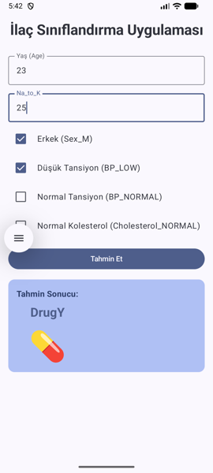

# Drug Classification Project

A machine learning-based drug classification system with Flask API backend and Android mobile application frontend.

## 🚀 Features

- **Machine Learning Model**: Drug classification based on patient characteristics
- **REST API**: Flask-based backend service
- **Mobile App**: Android application with modern UI
- **Clean Architecture**: MVVM pattern with dependency injection
- **Real-time Prediction**: Instant drug recommendations

## 🏗️ Architecture

```
├── api/                    # Flask API backend
├── dataset/               # Training data
├── MLmodel/              # Trained model files
├── MLnotebook/           # Jupyter notebooks
├── mobile/               # Android application
└── requirements.txt      # Python dependencies
```

## 🛠️ Technologies Used

### Backend
- **Flask**: Web framework
- **scikit-learn**: Machine learning
- **pandas**: Data manipulation
- **numpy**: Numerical computing
- **joblib**: Model serialization

### Frontend
- **Android**: Native mobile app
- **Jetpack Compose**: Modern UI toolkit
- **Hilt**: Dependency injection
- **Retrofit**: HTTP client
- **Moshi**: JSON serialization

## 📱 Screenshots



*Android application interface showing the drug prediction form with input fields for patient characteristics.*

## 🚀 Getting Started

### Prerequisites

- Python 3.8+
- Android Studio
- Git

### Installation

1. **Clone the repository**
   ```bash
   git clone https://github.com/AhmetBugraKaplan/DrugClassificationMobileApp.git
   cd DrugClassificationMobileApp
   ```

2. **Backend Setup**
   ```bash
   # Create virtual environment
   python -m venv venv
   
   # Activate virtual environment
   # On Windows:
   venv\Scripts\activate
   # On macOS/Linux:
   source venv/bin/activate
   
   # Install dependencies
   pip install -r requirements.txt
   
   # Run the API server
   python api/app.py
   ```

3. **Android App Setup**
   - Open Android Studio
   - Import the project from `mobile/DrugClassificationMobileApp/`
   - Sync Gradle files
   - Run on emulator or device

## 📊 API Usage

### Endpoints

#### Predict Drug
```http
POST /predict
Content-Type: application/json

{
  "Age": 25,
  "Na_to_K": 12.5,
  "Sex_M": true,
  "BP_LOW": false,
  "BP_NORMAL": true,
  "Cholesterol_NORMAL": false
}
```

#### Response
```json
{
  "prediction": "DrugY"
}
```

### Parameters

| Parameter | Type | Description |
|-----------|------|-------------|
| Age | Integer | Patient age |
| Na_to_K | Float | Sodium to Potassium ratio |
| Sex_M | Boolean | Male gender (true/false) |
| BP_LOW | Boolean | Low blood pressure |
| BP_NORMAL | Boolean | Normal blood pressure |
| Cholesterol_NORMAL | Boolean | Normal cholesterol level |

## 🧪 Model Information

The model uses the following features for drug classification:
- Patient demographics (age, sex)
- Blood pressure levels
- Cholesterol levels
- Sodium to Potassium ratio

### Drug Classes
- **DrugA**: For specific conditions
- **DrugB**: For specific conditions
- **DrugC**: For specific conditions
- **DrugX**: For specific conditions
- **DrugY**: For specific conditions

## 🔧 Development

### Project Structure

```
api/
├── app.py                 # Flask application
dataset/
├── drug200.csv           # Training dataset
MLmodel/
├── drug_model.pkl        # Trained model
mobile/
└── DrugClassificationMobileApp/
    ├── app/
    │   ├── src/main/java/com/example/drugclassificationcursor/
    │   │   ├── data/          # Data layer
    │   │   ├── domain/        # Domain layer
    │   │   ├── presentation/  # Presentation layer
    │   │   └── di/           # Dependency injection
    │   └── build.gradle.kts
    └── build.gradle.kts
```

### Running Tests

```bash
# Backend tests
python -m pytest

# Android tests
# Run from Android Studio
```

## 🤝 Contributing

We welcome contributions! Please see our [Contributing Guide](CONTRIBUTING.md) for details.

1. Fork the repository
2. Create a feature branch
3. Make your changes
4. Add tests if applicable
5. Submit a pull request

## 📝 License

This project is licensed under the MIT License - see the [LICENSE](LICENSE) file for details.

## 👥 Authors

- **Ahmet Bugra Kaplan** - *Initial work* - [AhmetBugraKaplan](https://github.com/AhmetBugraKaplan)

## 🙏 Acknowledgments

- Dataset source
- Libraries and frameworks used
- Contributors and testers

## 📞 Support

If you have any questions or need help, please:
- Open an issue on GitHub
- Contact the maintainers
- Check the documentation

## 🔮 Future Enhancements

- [ ] Web dashboard
- [ ] iOS application
- [ ] Model retraining pipeline
- [ ] Advanced analytics
- [ ] User authentication
- [ ] Multi-language support

---

⭐ If you found this project helpful, please give it a star!
